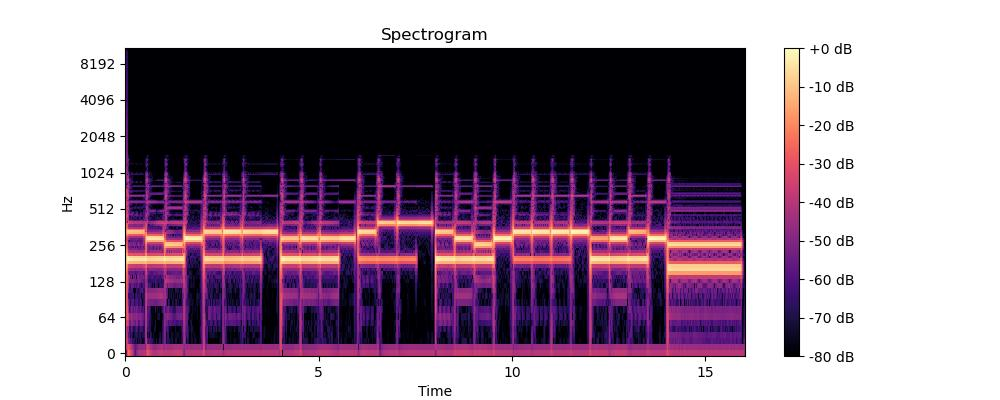
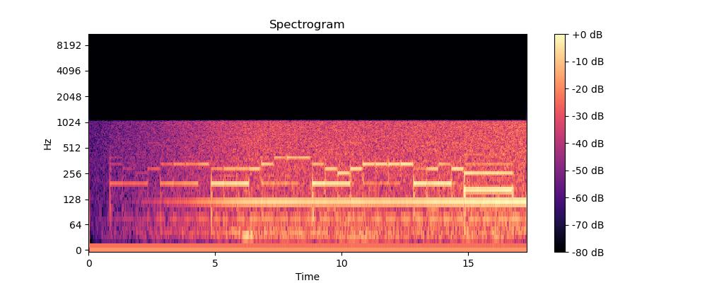

# visual-microphone-project

This project consists of a Python implementation of [Visual Microphone](https://people.csail.mit.edu/mrub/VisualMic/)


## Install requirements:
Simply run:
```
pip install -r requirements.txt
```
If running in a linux environment, then install libgl1 library:
```
apt-get install libgl1
```
## Usage:
```
python main.py --video_path data/test_vid.mp4 --output_path out.wav
```

To test the code on a real video from the Visual Microphone project, you can get the video with the following command:
```
## The video size is approximately 11Gb
wget https://data.csail.mit.edu/vidmag/VisualMic/Results/Chips2-2200Hz-Mary_MIDI-input.avi
```

The resulting audio from this video using this code is `data/result.wav`. You can also find the source audio in `data/MaryMIDI.mp3`

To visualize the spectrogram of an audio signal, run the following:
```
python show_spectrogram.py --audio_path data/result.wav
```

Here are the spectrograms for the source audio and the resulting audio respectively:

 
